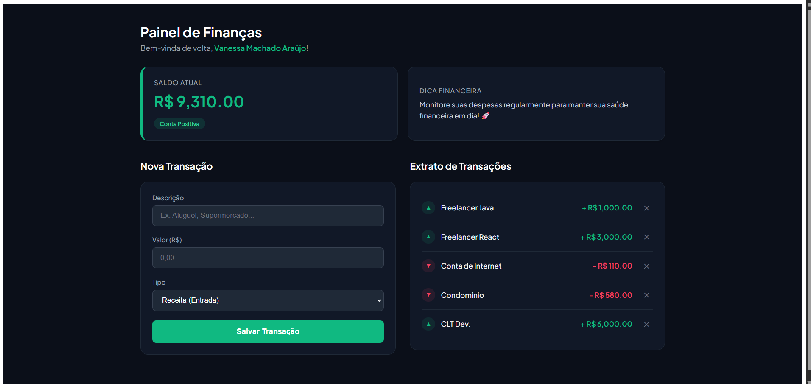

# 💰 Painel de Finanças Pessoais

Uma aplicação full-stack moderna e reativa para controle de finanças pessoais, desenvolvida com o objetivo de aplicar as melhores práticas de arquitetura de software, design de interface de alta fidelidade e pirâmide de testes automatizados (unitários, integração e ponta a ponta).

---

## 🖥️ Demonstração Visual

O painel conta com uma interface minimalista com tema escuro (Dark/Emerald), inspirada nas fintechs mais modernas do mercado.



- **Cards de Resumo:** Exibição dinâmica de saldo atual com alertas visuais baseados no status da conta (positivo/negativo).
- **Formulário Inteligente:** Inputs modernos com estados de foco interativos e validação de tipo de transação (Receita/Despesa).
- **Extrato Reativo:** Atualização instantânea da lista de transações em tempo real sem a necessidade de recarregar a página.

---

## 🛠️ Tecnologias & Ferramentas Utilizadas

### Backend

- **Java (JDK 21):** Linguagem robusta e fortemente tipada para o núcleo de negócios.
- **Javalin:** Microframework web leve para construção de APIs REST rápidas e eficientes.
- **PostgreSQL:** Banco de dados relacional de alta performance para persistência confiável das transações.
- **JUnit & Mockito:** Testes de unidade e de integração para validação do comportamento da API.

### Frontend

- **Angular:** Framework SPA estruturado para garantir escalabilidade e componentização.
- **TypeScript:** Garantia de segurança de tipos e melhor legibilidade no desenvolvimento cliente.
- **Jasmine & Karma:** Testes unitários do frontend.
- **Cypress:** Testes End-to-End (E2E).
- **Google Fonts & CSS Custom Properties:** Estilização moderna.

---

## 📐 Arquitetura do Projeto

O sistema foi arquitetado utilizando uma abordagem **Client-Server Architecture**.

```text
+---------------------+        HTTP / JSON        +----------------------+
| Frontend (Angular)  |  <--------------------->  | Backend (Javalin)    |
+---------------------+                           +----------------------+
         |                                                  |
         |                                                  |
         |                                                  |
         |                                           JDBC
         |                                                  |
         |                                                  v
         |                                         +------------------+
         |                                         |   PostgreSQL     |
         |                                         +------------------+
         |
         +-- Jasmine / Karma (Unit)
         +-- Cypress (E2E)

Backend:
- JUnit
- Mockito
```

---

## 🧪 Estratégia de Testes

Este projeto foi desenvolvido seguindo a Pirâmide de Testes.

### 1. Testes de Unidade e Integração (Backend)

Garantem que as rotas da API, regras de negócio e persistência funcionem corretamente.

### 2. Testes Unitários (Frontend)

- `transacao.service.spec.ts`
- `app.component.spec.ts`

Utilizando **Jasmine** e **Karma**.

### 3. Testes End-to-End (Cypress)

Fluxo validado:

1. Acessa a aplicação.
2. Preenche o formulário.
3. Salva uma transação.
4. Verifica se a transação aparece no extrato.

---

## ⚙️ Como Executar

### Pré-requisitos

- Java 21+
- Node.js LTS
- PostgreSQL

### Backend

```bash
cd financas-app-backend
```

Configure o banco de dados e execute:

```bash
mvn clean install
mvn exec:java
```

Servidor disponível em:

```text
http://localhost:8080
```

### Frontend

```bash
cd financas-front
npm install
npm start
```

Acesse:

```text
http://localhost:4200
```

---

## 🏃 Executando os Testes

### Frontend

```bash
npx ng test
```

### Cypress

```bash
npx cypress open
```